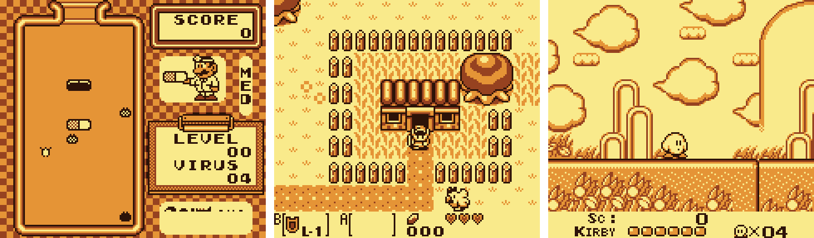

# Brick Boy

WIP Game boy emulator



## Building

You will need `cmake`, `make` and a C compiler (GCC or Clang).

```bash
mkdir build
cd build
cmake .. -DCMAKE_BUILD_TYPE=Release
make
```

## Running

```bash
./brickboy <rom.gb>
```

## Controls

* `W` `A` `S` `D` - D-Pad
* `RShift` - Select
* `Enter` - Start
* `J` - A
* `K` - B

## Hotkeys

* `F1` - Toggle debug view
* `F2` - Change color palette
* `F12` - Take screenshot
* `Esc` - Quit

## Status

 * [x] CPU
 * [x] Timer
 * [x] Background
 * [x] Window
 * [x] DMA
 * [x] Sprites 8x8
 * [x] Sprites 8x16
 * [ ] Scrolling
 * [ ] Sound
 * [x] Input
 * [ ] Mappers
 * [x] Boot ROM
 * [x] Battery save

## CPU tests (Blargg's)

 - [x] 01-special
 - [x] 02-interrupts
 - [x] 03-op sp,hl
 - [x] 04-op r,imm
 - [x] 05-op rp
 - [x] 06-ld r,r
 - [x] 07-jr,jp,call,ret,rst
 - [x] 08-misc instrs
 - [x] 09-op r,r
 - [x] 10-bit ops
 - [x] 11-op a,(hl)


## Tested Games

| Game | Status | Notes |
|------|--------|-------|
| Tetris | Playable ||
| Dr. Mario | Playable ||
| Super Mario Land | Playable ||
| The Legend of Zelda: Link's Awakening | Playable ||

## Resources

- [Pan Docs](https://gbdev.io/pandocs/)
- [CPU Manual](http://marc.rawer.de/Gameboy/Docs/GBCPUman.pdf)
- [Opcodes Table](https://meganesu.github.io/generate-gb-opcodes/) by meganesu
- [Gameboy Logs](https://github.com/wheremyfoodat/Gameboy-logs) by wheremyfoodat
- [Test ROMs](https://github.com/retrio/gb-test-roms) (mirror of Blargg’s tests)
- [The Gameboy Emulator Development Guide](https://hacktix.github.io/GBEDG/) by Hacktix
- [Bootix - DRM-free Gameboy boot ROM](https://github.com/Hacktix/Bootix) by Hacktix
- [Lazy Gameboy Emulator](https://cturt.github.io/cinoop.html) by CTurt
- [Gameboy Palettes](https://www.deviantart.com/thewolfbunny64/gallery/69987002/game-boy-palettes) by TheWolfBunny64
